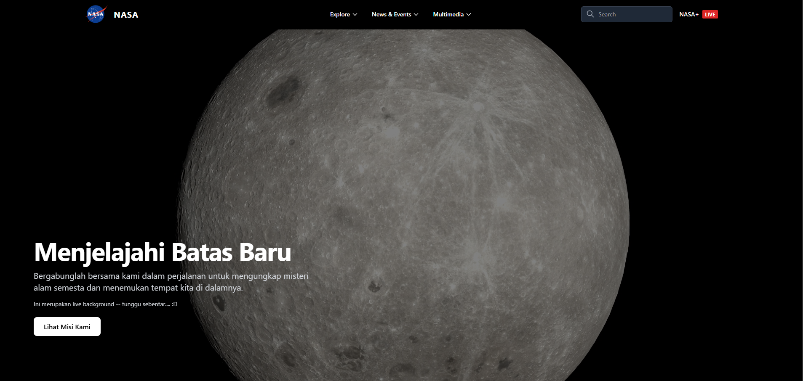
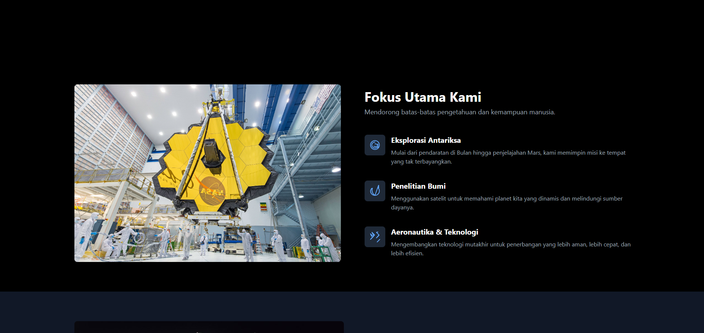
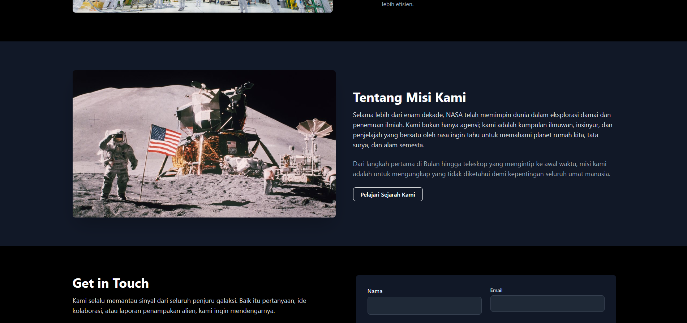
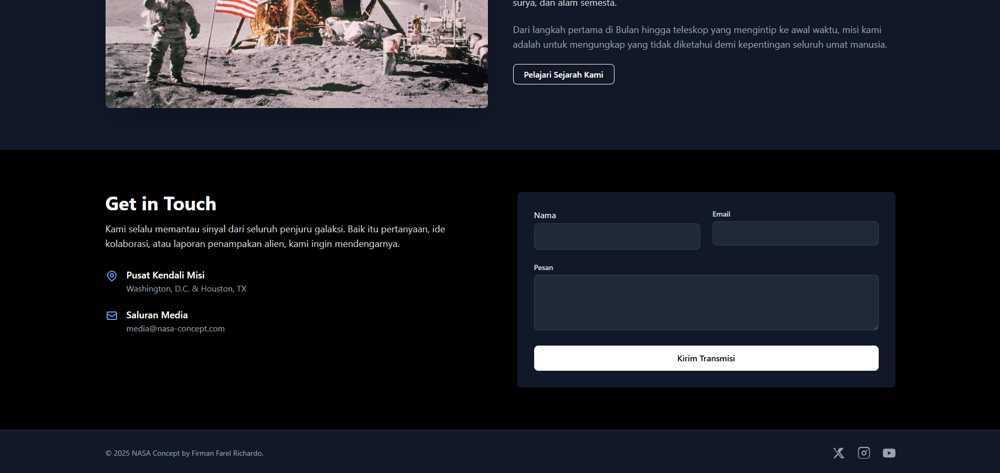

# NASA Landing Page Concept

Ini adalah proyek tugas akhir percobaan 3 untuk mata kuliah praktikum pemrograman web, di mana tujuannya adalah membuat *landing page* yang sepenuhnya responsif untuk NASA dengan konsep desain yang modern, gelap, dan sinematik.

Proyek ini dibangun dari nol menggunakan **Tailwind CSS (via CDN)** dan **HTML5**, dengan fokus pada *layout* yang bersih, estetika *dark-mode*, dan penggunaan *grid* yang kompleks dan responsif.

---

## Pratinjau Halaman (Screenshots)

Berikut adalah tampilan dari komponen-komponen utama halaman, sesuai urutan:

### 1. Header, Navigasi & Hero Section
Tampilan *header* "Command Center" 3-kolom yang *sticky* dan *hero section* dengan *background* video dan tata letak teks "sinematik".

### 2. Features Section
Menggunakan *layout* asimetris 2-kolom dengan visual di sebelah kiri dan daftar fitur di sebelah kanan untuk tampilan yang lebih premium.

### 3. About Section
Tata letak 2-kolom klasik untuk menampilkan gambar dan teks deskripsi perusahaan.

### 4. Contact & Footer Section
Bagian "Get in Touch" dengan *layout* 2-kolom (Info & Form) dan *footer* yang bersih.

---

## Fitur Utama

Berdasarkan file `index.html`, halaman ini mencakup:

* **Header Sticky:** *Header* 3-kolom ("Command Center") yang tetap menempel di atas dengan efek *backdrop-blur* (glassmorphism) saat di-scroll.
* **Hero Section Dinamis:** Menggunakan *background* video yang diputar otomatis, dengan tata letak teks "sinematik" (kiri bawah) di desktop dan tengah di *mobile*.
* **Layout Responsif Penuh:** Dibangun dengan pendekatan *mobile-first* dan menggunakan *breakpoint* `md:` dan `lg:` dari Tailwind untuk beradaptasi di semua ukuran layar.
* **Layout Asimetris:** *Section* "Fokus Utama Kami" menggunakan *layout* 2-kolom (Gambar + Daftar) yang unik.
* **Form Kontak Kompleks:** Menggunakan *grid* bersarang (*nested grid*) untuk *layout* form 2-kolom di dalam *section* 2-kolom.
* **Komponen Murni HTML/Tailwind:** Seluruh proyek (kecuali *background* video) dibangun hanya dengan HTML5 dan Tailwind CSS tanpa JavaScript kustom.

---

## 💻 Tumpukan Teknologi (Tech Stack)

* **HTML5** (Semantik)
* **Tailwind CSS** (via CDN)

---

## Cara Menjalankan

Karena proyek ini menggunakan CDN Tailwind dan tidak memerlukan kompilasi:
1.  *Clone* repositori ini: `git clone https://github.com/firmanfarelrichardo/nasa_landingpage.git`
2.  Masuk ke direktori: `cd nasa_landingpage`
3.  Buka file `index.html` langsung di browser (Google Chrome, Firefox, dll).

---

## 👨‍💻 Dibuat Oleh

* **Firman Farel Richardo**

(Informasi diambil dari footer di `index.html` dan `README.md` asli)
